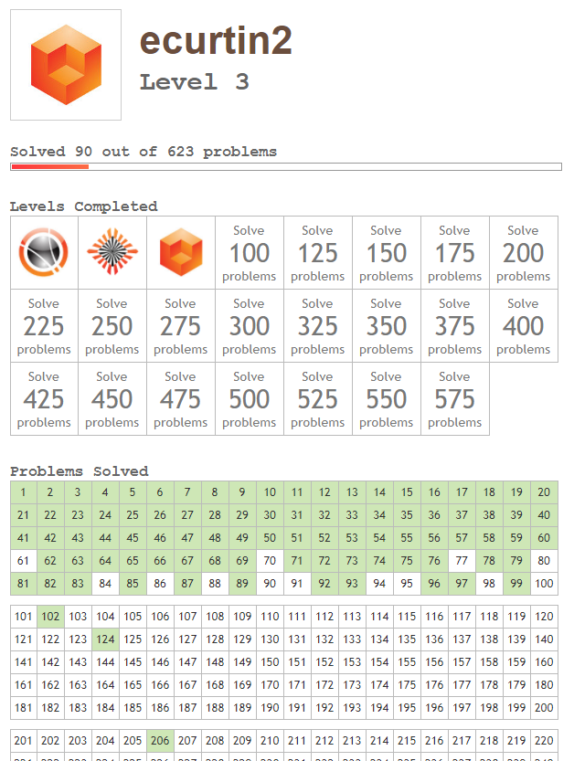

# Project-Euler
Solutions to [Project Euler](https://projecteuler.net/) Problems

Python files were made by scraping the Project Euler questions and inserting
them as comments. The solutions are all done in python.

# Current Progress:

